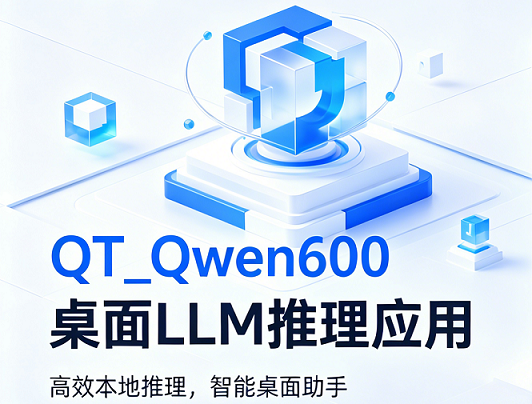
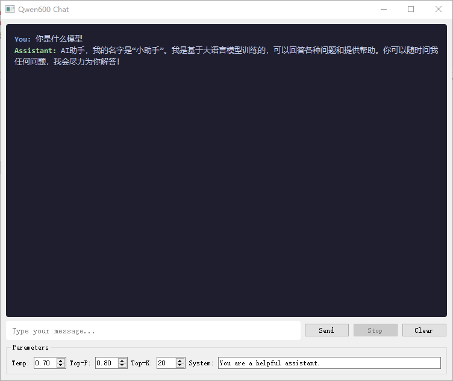

[English](README_EN.md) | 中文

[](https://developer.nvidia.com/cuda-toolkit)
[](https://www.qt.io/)
[](LICENSE)
[](https://huggingface.co/Qwen/Qwen3-0.6B)

<p align="center">
  
</p>

# qwen600.qt

基于 [qwen600.cu](https://github.com/yassa9/qwen600) 的桌面 LLM 推理应用。在原始 CUDA 推理引擎基础上，新增 Qt 图形界面、KV Cache INT8 量化、Softmax 内核修复与 RoPE 预计算优化。

## 特性亮点

- **Qt 桌面聊天界面** — 实时流式输出、后台推理线程、可调参数面板
- **KV Cache INT8 量化** — Per-head 对称量化，KV 缓存显存降低 ~50%（3.5 GB → 1.8 GB）
- **Softmax Kernel 修复** — 多 block size 自适应调度，数值稳定的并行归约
- **RoPE 预计算表** — 初始化时一次性计算 sin/cos 查找表，消除推理时冗余三角函数调用

## 截图

<p align="center">
  
</p>

## 快速开始

### 环境要求

| 依赖 | 版本要求 |
|------|---------|
| CUDA Toolkit (nvcc, cuBLAS, CUB) | 12.0+ |
| Qt5 (Widgets 模块) | 5.15+ |
| CMake | 3.20+ |
| GPU 显存 | 建议 ≥ 6 GB |

### 模型下载

从 Hugging Face 下载 [Qwen3-0.6B](https://huggingface.co/Qwen/Qwen3-0.6B) 模型，确保目录中包含 `model.safetensors`。

```bash
# 验证权重文件完整性
sha256sum model.safetensors
# 预期: f47f71177f32bcd101b7573ec9171e6a57f4f4d31148d38e382306f42996874b
```

导出分词器：

```bash
python export.py <model_dir>
```

### 编译

```bash
mkdir build && cd build
cmake .. && make -j$(nproc)
```

### 配置

编辑 `app_config.h` 指定模型路径：

```cpp
#define MODEL_DIR "path/to/Qwen3-0.6B"
```

编辑 `config.h` 控制 INT8 量化开关：

```cpp
constexpr bool USE_KV_CACHE_INT8 = true;  // false 则使用原始 BF16
```

### 运行

编译完成后直接启动即可，Qt 窗口会自动加载模型并进入聊天：

```bash
./QT_Qwen600
```

## 技术实现

### KV Cache INT8 量化

**问题：** BF16 KV 缓存在 32K 上下文下占用 ~3.3 GB 显存。

**方案：** 对每个 token 的 K/V 向量，在完成 QK-Norm 和 RoPE 后，按 attention head 粒度做对称 INT8 量化：

```
scale = max(|head_vector|) / 127
int8_value = clamp(round(value / scale), -127, 127)
```

Attention 计算时实时反量化：`float_value = int8_value × scale`

**显存对比：**

| 组件 | BF16 | INT8 |
|------|------|------|
| K 缓存 | 1.75 GB | 875 MB |
| V 缓存 | 1.75 GB | 875 MB |
| Scale 数组 | — | 57.4 MB |
| **合计** | **3.5 GB** | **~1.8 GB** |

**新增 CUDA Kernel：**
- `quantize_kv_head_kernel` — 基于 `cub::BlockReduce` 的 per-head absmax 量化
- `attention_qk_kernel_int8` — QK 点积中实时反量化 INT8 K 缓存
- `attention_v_kernel_int8` — V 加权求和中实时反量化 INT8 V 缓存

**设计要点：**
- RoPE 和 QK-Norm 在 BF16 精度下完成后再量化，不损失旋转编码精度
- Scale 以 float32 存储，避免额外精度损失
- 通过 `if constexpr` 编译期分支，非活跃路径零开销

### Softmax Kernel 优化

实现了数值稳定的并行 softmax，使用 `cub::BlockReduce` 进行 max-reduce 和 sum-reduce。调度器根据序列长度自动选择最优 block size（64 / 256 / 512 / 1024 threads），避免短序列浪费线程或长序列线程不足。

### RoPE 预计算表

模型初始化时调用 `rope_precompute_init` 一次性计算全部位置的 cos/sin 值，存储为 GPU 端查找表（shape: `SEQ_LEN × HEAD_DIM/2`）。推理时通过 `rope_gpu_table` 按 position 索引查表，替代原始逐 token 的 `sincosf` / `powf` 在线计算。

### Qt 图形界面

基于 Qt5 Widgets 的原生桌面聊天应用：

- **异步推理：** `InferenceWorker` 在独立 QThread 中运行，通过信号槽机制逐 token 流式更新 UI
- **参数面板：** 实时调节 temperature、top-p、top-k 和 system prompt
- **交互控制：** 发送、停止生成、清除上下文
- **深色主题：** Catppuccin 风格配色，等宽字体渲染

## 项目结构

```
qwen600.qt/
├── CMakeLists.txt              构建配置（CUDA + Qt5）
├── config.h                    模型常量 & INT8 量化开关
├── app_config.h                运行时配置（模型路径、采样参数）
├── qwen_model.cuh              CUDA 内核（attention、量化、RoPE、RMSNorm、SwiGLU）
├── static_loader.h             safetensors 权重加载（mmap + async copy）
├── tokenizer.h                 BPE 分词器
├── sampler.h                   Top-k / Top-p / Temperature 采样
├── inference_engine.h          C++ 推理 API 接口（PIMPL 模式）
├── inference_engine_impl.cu    推理引擎 CUDA 实现
├── mainwindow.h / .cpp         Qt 聊天窗口
├── main.cpp                    应用入口
└── assets/                     图片资源
```

## 致谢

本项目基于以下工作：

- [qwen600.cu](https://github.com/yassa9/qwen600) — 原始推理引擎 by yassa9
- [llama2.c](https://github.com/karpathy/llama2.c) — Andrej Karpathy
- [Qwen3-0.6B](https://huggingface.co/Qwen/Qwen3-0.6B) — Qwen Team

## 许可证

[MIT](LICENSE)
